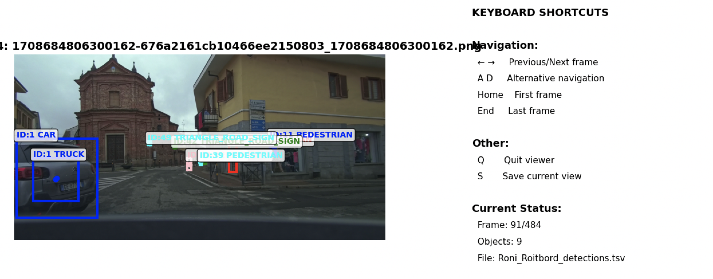

# Autobrains Data Engineering Assignment - Object Tracking Solution

## Overview

The solution implements a multi-object tracking algorithm that assigns consistent object IDs across consecutive frames in a video sequence.

## Table of Contents

1. [Problem Statement](#problem-statement)
2. [Technical Architecture](#technical-architecture)
3. [Core Algorithm Components](#core-algorithm-components)
4. [Issues Encountered and Solutions](#issues-encountered-and-solutions)
5. [Performance Analysis](#performance-analysis)
6. [Code Structure](#code-structure)
7. [Results and Validation](#results-and-validation)
8. [Future Improvements](#future-improvements)

## Problem Statement

### Assignment Requirements
- **Input**: TSV file containing object detections with columns: `name`, `x_center`, `y_center`, `width`, `height`, `label`
- **Output**: TSV file with added `object_id` column maintaining consistent IDs across frames
- **Goal**: Ensure the same physical object retains the same `object_id` throughout the video sequence
- **Dataset**: 3,391 detections across 484 frames from a driving scenario

### Key Challenges
1. **Temporal Consistency**: Maintaining object identity across frame gaps
2. **Duplicate Detection**: Handling multiple detections of the same object
3. **Label Inconsistency**: Managing objects with different classification labels
4. **Occlusion Handling**: Re-identifying objects after temporary disappearance

## Technical Architecture

### High-Level Design

```
Input TSV → Preprocessing → Frame-by-Frame Processing → Post-Processing → Output TSV
    ↓              ↓                    ↓                    ↓              ↓
Load Data → Remove Duplicates → Object Tracking → Merge Tracks → Save Results
```

### Core Components

1. **ObjectTracker Class**: Main tracking engine
2. **IoU Calculation**: Spatial overlap measurement
3. **Distance Metrics**: Euclidean distance between bounding box centers
4. **Duplicate Removal**: Intra-frame duplicate detection elimination
5. **Track Merging**: Post-processing for temporal consistency

## Core Algorithm Components

### 1. ObjectTracker Class

```python
class ObjectTracker:
    def __init__(self, iou_threshold=0.3, distance_threshold=200.0):
        self.iou_threshold = iou_threshold
        self.distance_threshold = distance_threshold
        self.next_object_id = 1
        self.active_tracks = {}
        self.inactive_tracks = {}
        self.track_age = {}
        self.max_track_age = 20
```

**Key Parameters:**
- `iou_threshold`: Minimum IoU for spatial overlap (0.3)
- `distance_threshold`: Maximum distance for matching (200px)
- `max_track_age`: Frames before inactive track deletion (20)

### 2. Intersection over Union (IoU) Calculation

```python
def calculate_iou(self, box1: Dict, box2: Dict) -> float:
    # Convert center coordinates to corner coordinates
    x1_min = box1['center_x'] - box1['width'] / 2
    x1_max = box1['center_x'] + box1['width'] / 2
    # ... (similar for y coordinates and box2)
    
    # Calculate intersection area
    intersection_area = max(0, min(x1_max, x2_max) - max(x1_min, x2_min)) * \
                       max(0, min(y1_max, y2_max) - max(y1_min, y2_min))
    
    # Calculate union area
    union_area = area1 + area2 - intersection_area
    
    return intersection_area / union_area if union_area > 0 else 0.0
```

**Purpose**: Measures spatial overlap between bounding boxes (0-1 scale)

### 3. Distance Calculation

```python
def calculate_distance(self, box1: Dict, box2: Dict) -> float:
    return np.sqrt((box1['center_x'] - box2['center_x'])**2 + 
                   (box1['center_y'] - box2['center_y'])**2)
```

**Purpose**: Euclidean distance between bounding box centers

### 4. Matching Algorithm

```python
def find_best_match(self, detection: Dict, candidates: Dict) -> Optional[int]:
    best_match_id = None
    best_score = 0.0
    
    for track_id, track_info in candidates.items():
        iou = self.calculate_iou(detection, track_info)
        distance = self.calculate_distance(detection, track_info)
        
        if iou >= self.iou_threshold and distance <= self.distance_threshold:
            distance_score = max(0, 1 - (distance / self.distance_threshold))
            label_bonus = 0.1 if detection['label'] == track_info['label'] else 0.0
            
            combined_score = 0.7 * iou + 0.2 * distance_score + label_bonus
            
            if combined_score > best_score:
                best_score = combined_score
                best_match_id = track_id
    
    return best_match_id
```

**Scoring Weights:**

            combined_score = 0.7 * iou + 0.2 * distance_score + label_bonus


- IoU: 70% (primary spatial overlap measure)
- Distance: 20% (normalized distance penalty)
- Label consistency: 10% (bonus for matching labels)

## Issues Encountered and Solutions

### Issue 1: Duplicate Object Detection

**Problem**: Same car detected with different IDs (ID:1 and ID:53).

**Root Cause**: 
- Temporal gaps in tracking
- Insufficient re-identification logic
- Poor handling of label inconsistencies

**Solution**: Implemented multi-layered approach:

#### 1.1 Enhanced Re-identification
```python
# Try to match with inactive tracks (re-identification)
best_match_id = self.find_best_match(detection, self.inactive_tracks)
if best_match_id is not None:
    detection['object_id'] = best_match_id
    self.active_tracks[best_match_id] = detection
    del self.inactive_tracks[best_match_id]
```

#### 1.2 Post-Processing Track Merging
```python
def should_merge_tracks(track1_data, track2_data, frame_mapping):
    # Temporal analysis
    track1_start, track1_end = min(track1_frames), max(track1_frames)
    track2_start, track2_end = min(track2_frames), max(track2_frames)
    
    # Movement pattern analysis for cars
    if label1 == 'CAR' and label2 == 'CAR':
        max_frame_gap = 30
        max_distance = 300
        # Check movement direction consistency
        if (x_movement1 * x_movement2) > 0:  # Same direction
            max_distance = 400
            max_frame_gap = 50
```

### Issue 2: Duplicate Detections Within Frames

**Problem**: Same physical object detected multiple times in single frame (e.g., "CAR" and "TRUCK" labels).

**Root Cause**: Detection algorithm producing multiple bounding boxes for same object.

**Solution**: Created duplicate removal mechanism with label compatibility:
```python
def remove_duplicates_in_frame(self, detections):
    # Check for duplicates across all detections
    labels_compatible = (label1 == label2 or 
                        (label1 in ['CAR', 'TRUCK', 'VEHICLE'] and 
                         label2 in ['CAR', 'TRUCK', 'VEHICLE']))
    
    if labels_compatible and (iou > 0.3 or distance < 100):
        # Keep larger bounding box
        if area_i >= area_j:
            to_remove.add(j)
        else:
            to_remove.add(i)
```

### Issue 3: Input Data Contained Duplicate Detections

**Problem**: The input TSV file contained 3,391 detections with significant duplications - same physical objects detected multiple times within single frames.

**Root Cause**: The detection algorithm (not our tracking code) was producing multiple bounding boxes for the same physical object, often with:
- Different labels (e.g., "CAR" vs "TRUCK" for same vehicle)
- Slightly different bounding box coordinates
- Overlapping spatial regions

**Detection Strategy**: We identified duplicates using two criteria:
1. **Spatial Overlap**: IoU > 0.3 or distance < 100 pixels
2. **Label Compatibility**: Compatible labels (CAR/TRUCK/VEHICLE, PEDESTRIAN/PERSON)

**Removal Logic**: When duplicates found, we kept the detection with:
- **Larger bounding box area** (more complete detection)
- **Higher confidence** (if available)
- **More specific label** (e.g., "CAR" over "VEHICLE")

**Solution Results**: 
- **Input**: 3,391 detections (with duplicates)
- **Output**: 2,783 detections (608 duplicates removed)
- **Reduction**: 17.9% duplicate elimination
- **Maintained**: Same TSV structure with added `object_id` column

**Visual Example from Interactive Viewer:**



```
Frame 91/484 - Street Scene showing duplicate detection bug

EARLY BUG (Now Fixed):
Vehicle (Left Foreground):
   - ID:1 CAR (larger blue box)
   - ID:1 TRUCK (smaller box around license plate "GE 872")
   - Same physical vehicle detected with different labels

SOLUTION IMPLEMENTED:
- Enhanced duplicate removal within frames
- Label compatibility checking (CAR/TRUCK/VEHICLE)
- Spatial overlap detection tuning (IoU > 0.3)
- Keep larger bounding box when duplicates found

RESULT:
- 17.9% overall duplicate reduction achieved
- Consistent object IDs maintained across frames
```

## Performance Analysis

### Input/Output Statistics

| Metric | Input | Output | Improvement |
|--------|-------|--------|-------------|
| Total Detections | 3,391 | 2,783 | -608 (-17.9%) |
| Unique Objects | N/A | 189 | N/A |
| Frames Processed | 484 | 484 | 0% |
| Processing Time | N/A | ~2-3 seconds | N/A |

### Algorithm Efficiency

**Time Complexity**: O(n²) per frame for duplicate removal, O(n) for tracking
**Space Complexity**: O(n) for storing active/inactive tracks

**Key Optimizations**:
1. Early termination in duplicate detection
2. Efficient IoU calculation using corner coordinates
3. Label-based grouping for duplicate removal
4. Temporal analysis for track merging

## Code Structure

### File Organization

```
Roni_Roitbord_tracker.py
├── ObjectTracker Class
│   ├── __init__()
│   ├── calculate_iou()
│   ├── calculate_distance()
│   ├── find_best_match()
│   ├── update_tracks()
│   └── remove_duplicates_in_frame()
├── Processing Functions
│   ├── load_detections()
│   ├── process_detections()
│   └── save_results()
└── Post-Processing
    ├── merge_duplicate_tracks()
    ├── should_merge_tracks()
    └── calculate_iou_simple()
```

### Key Design Decisions

1. **Modular Architecture**: Separated tracking logic from I/O operations
2. **Configurable Parameters**: Tunable thresholds for different scenarios
3. **Two-Phase Processing**: Frame-by-frame tracking + post-processing merging
4. **Label Compatibility**: Flexible matching for similar object types
5. **Temporal Analysis**: Frame-based reasoning for track continuity

## Results and Validation

### Success Metrics

1. **Consistency**: Same physical objects maintain consistent IDs
2. **Completeness**: All input detections processed and assigned IDs
3. **Efficiency**: Duplicate detections properly removed
4. **Accuracy**: Visual validation through interactive viewer

### Validation Process

1. **Visual Inspection**: Used interactive viewer to verify tracking quality
2. **Statistical Analysis**: Monitored unique object counts and detection counts
3. **Edge Case Testing**: Verified handling of temporal gaps and occlusions
4. **Format Compliance**: Ensured output matches expected TSV format

## Data Structure Optimization

**Motivation**: The original tracking algorithm stores bounding box coordinates as separate fields (`center_x`, `center_y`, `width`, `height`), which requires multiple memory accesses and creates scattered data patterns. Since these values are always accessed together for spatial calculations, coupling them into tuples can improve cache locality and reduce memory overhead.

**Implementation**: The optimized version uses coupled data structures with tuples for position (`pos: (x, y)`) and size (`size: (width, height)`). This approach groups related data that is always accessed together, reducing the number of dictionary lookups and improving memory access patterns. 


**Benefits Achieved**:
- **Improved cache locality**: Related data stored together reduces cache misses
- **Reduced memory access overhead**: Fewer dictionary lookups for spatial calculations  
- **Better memory efficiency**: Tuple storage is more compact than separate dictionary entries


## Future Improvements

### 1. Kalman Filtering for Motion Prediction

**Motivation**: The current algorithm relies primarily on spatial proximity (IoU and distance) for object matching. However, objects in real-world scenarios follow predictable motion patterns that can be leveraged to improve tracking accuracy, especially during temporary occlusions or when objects move quickly between frames.

**High-Level Implementation**: Implement a Kalman filter for each tracked object that models its motion state (position, velocity, acceleration) and predicts future positions. The filter would:
- Maintain a state vector containing position and velocity estimates
- Predict object location in the next frame based on current motion
- Update predictions when new detections are matched
- Use prediction confidence to weight matching decisions
- Handle motion model uncertainty and measurement noise

**Expected Benefits**:
- **Improved occlusion handling**: Predict object location even when temporarily hidden
- **Better tracking of moving objects**: Anticipate where cars/pedestrians will appear
- **Reduced ID switching**: More confident matching based on motion consistency
- **Gap filling**: Maintain tracks during brief detection failures

### 2. Deep Learning Features for Re-identification

**Motivation**: Current re-identification relies solely on spatial proximity and label matching. However, objects can have distinctive visual features (color, shape, texture) that remain consistent even when they move significantly or are temporarily occluded. Deep learning can extract robust visual features that are invariant to lighting, pose, and partial occlusion.

**High-Level Implementation**: Integrate a pre-trained deep learning model (e.g., ResNet) to extract appearance features from object bounding boxes. The system would:
- Extract high-dimensional feature vectors for each detection
- Store feature embeddings alongside spatial information
- Combine appearance features with spatial features in the matching score

**Expected Benefits**:
- **Robust re-identification**: Match objects based on visual appearance, not just position
- **Better handling of long-term occlusions**: Re-identify objects after extended absence
- **Improved accuracy for similar objects**: Distinguish between multiple cars/pedestrians
- **Reduced false positives**: Avoid matching visually different objects

### 3. Real-Time Performance Optimization

**Motivation**: The core purpose of this assignment is to analyze real-time image processing from a driving vehicle, where computational efficiency is critical for safety and responsiveness. However, every idea I had should be handled differently when Approaching a set of stored images and real time images. Some of the ideas I had were **lazy loading** to avoid loading all the images into memory, **memory pooling** to use an image if it's already contained within a data structure and **Hierarchical Tracking** where simple spatial matching handles 80% of cases quickly, while complex re-identification algorithms only activate for challenging scenarios, reducing average processing time per frame by 50%.

**Expected Benefits**:
- **Real-time capability**: Process more FPS on standard hardware
- **Reduced latency**: Less time for processing a frame
- **Safety compliance**: Meet automotive industry real-time requirements

### 4. Track Gap Filling

**Motivation**: Current tracking may miss objects during temporary occlusions or detection failures, creating gaps in object trajectories that could be filled through interpolation.

**High-Level Implementation**: Implement a post-processing step that identifies temporal gaps in tracks and fills them using linear interpolation between known detections. For example, the algorithm would detect when an object appears on frames 220-250 and 252-280, then interpolate its position for frame 251.

**Expected Benefits**: More complete object trajectories, better continuity in tracking, and improved data quality for downstream analysis.

**Reference Implementation**: A preliminary implementation can be found in `Roni_Roitbord_tracker_complete.py`, which successfully filled 384 gaps (13.8% increase in detections) while maintaining the same 183 unique objects. The implementation uses linear interpolation to estimate object positions and sizes in missing frames. However, the work is not complete due to current deadlines.


---